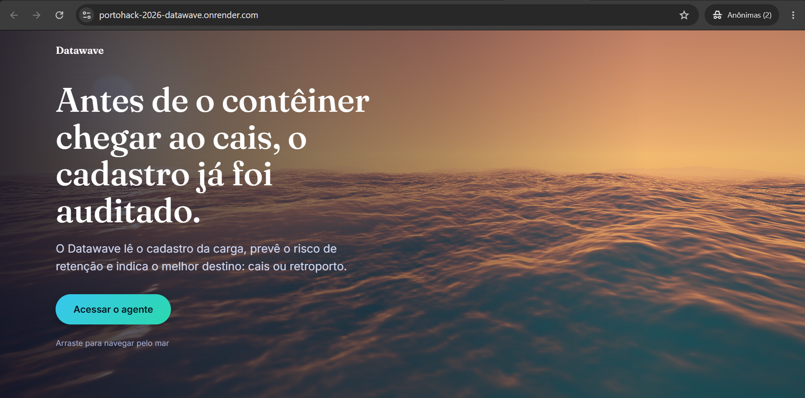
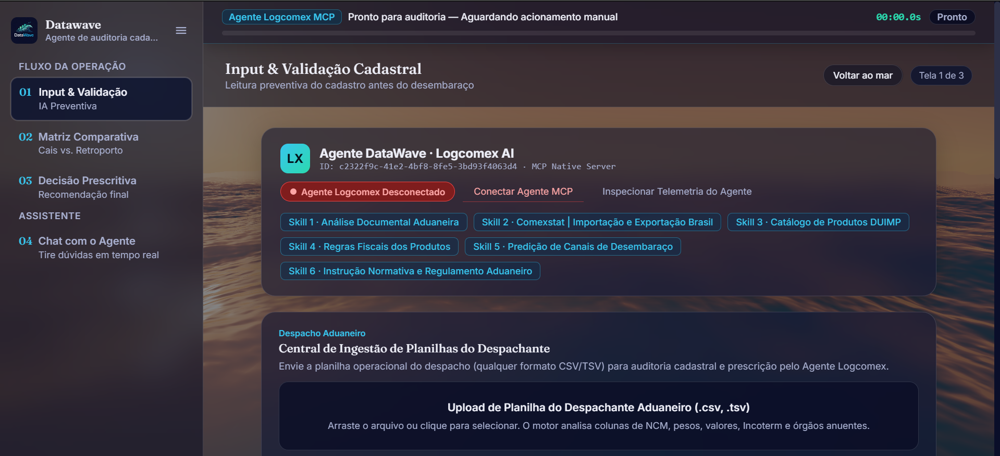
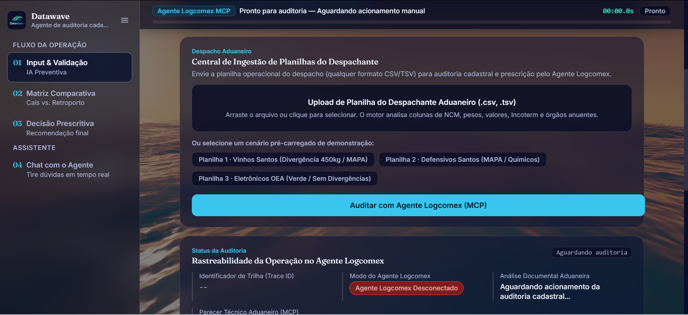
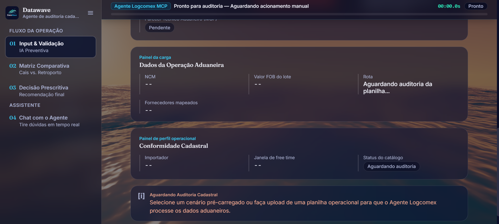
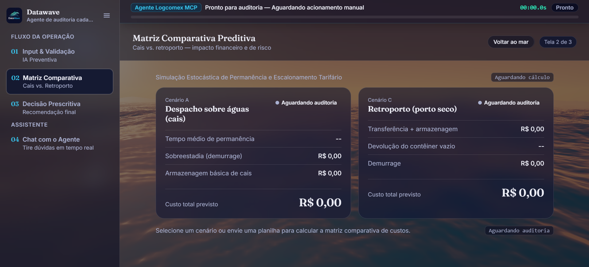
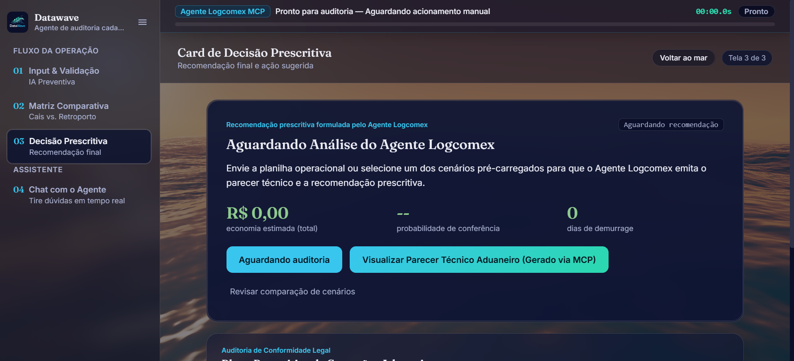
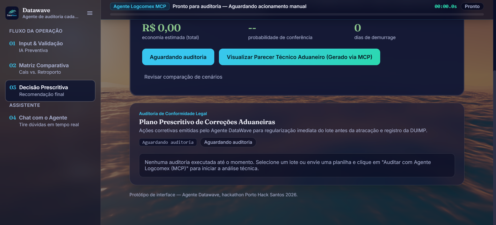
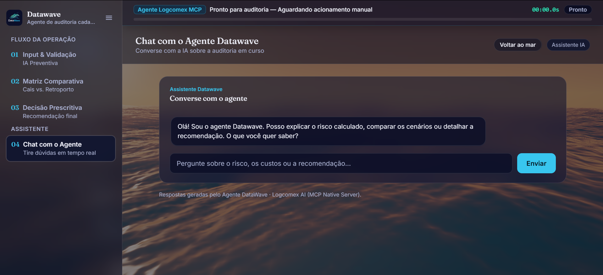

# 🌊 Datawave — Agente de Auditoria Cadastral

> **Antes de o contêiner chegar ao cais, o cadastro já foi auditado.**

O **Datawave** lê o cadastro da carga, prevê o risco de retenção e indica o melhor destino: **cais** ou **retroporto**.

Projeto desenvolvido para o hackathon **Porto Hack Santos 2026**.

🔗 **Protótipo online:** https://portohack-2026-datawave.onrender.com

---

## 📸 Telas e funcionalidades

### 1. Página inicial

Apresenta a proposta do Datawave. O botão **"Acessar o agente"** leva à área de trabalho e o fundo animado de mar pode ser arrastado para navegar.



---

### 2. Input & Validação Cadastral (Tela 1 de 3)

Ponto de partida da operação. Aqui o usuário:

- vê o status de conexão do **Agente Logcomex AI** (MCP Native Server);
- consulta as **6 skills** que o agente utiliza:
  1. Análise Documental Aduaneira
  2. Comexstat — Importação e Exportação Brasil
  3. Catálogo de Produtos DUIMP
  4. Regras Fiscais dos Produtos
  5. Predição de Canais de Desembaraço
  6. Instrução Normativa e Regulamento Aduaneiro
- envia a planilha do despachante (**.csv ou .tsv**), arrastando o arquivo ou clicando para selecionar. O motor analisa NCM, pesos, valores, Incoterm e órgãos anuentes.



---

### 3. Cenários de demonstração e auditoria

Sem planilha à mão? Há três cenários pré-carregados:

| Cenário | O que mostra |
|---|---|
| **Planilha 1 · Vinhos Santos** | Divergência de 450 kg / MAPA |
| **Planilha 2 · Defensivos Santos** | MAPA / Químicos |
| **Planilha 3 · Eletrônicos OEA** | Caso verde, sem divergências |

O botão **"Auditar com Agente Logcomex (MCP)"** inicia a análise. O painel **Status da Auditoria** mostra o identificador de trilha (Trace ID), o modo do agente e o andamento da análise documental e do parecer técnico.



---

### 4. Painéis da carga e conformidade

Depois da auditoria, esta tela mostra os dados extraídos da operação:

- **Dados da Operação Aduaneira:** NCM, valor FOB do lote, rota e fornecedores mapeados.
- **Conformidade Cadastral:** importador, janela de *free time* e status do catálogo.



---

### 5. Matriz Comparativa Preditiva (Tela 2 de 3)

Compara o custo e o risco entre dois caminhos:

- **Cenário A — Despacho sobre águas (cais):** tempo médio de permanência, sobrestadia (demurrage), armazenagem básica e custo total previsto.
- **Cenário C — Retroporto (porto seco):** transferência + armazenagem, devolução do contêiner vazio, demurrage e custo total previsto.



---

### 6. Card de Decisão Prescritiva (Tela 3 de 3)

A recomendação final do agente, com os principais indicadores:

- 💰 **economia estimada** (total);
- 🎯 **probabilidade de conferência**;
- ⏱️ **dias de demurrage**.

Também permite abrir o **Parecer Técnico Aduaneiro** (gerado via MCP) e voltar à comparação de cenários.



---

### 7. Plano Prescritivo de Correções Aduaneiras

Lista as ações corretivas emitidas pelo agente para regularizar o lote **antes da atracação e do registro da DUIMP**.



---

### 8. Chat com o Agente

Um assistente para tirar dúvidas em tempo real sobre a auditoria em curso: explicar o risco calculado, comparar cenários ou detalhar a recomendação.



---

## 🧭 Fluxo da operação

```
01 Input & Validação  →  02 Matriz Comparativa  →  03 Decisão Prescritiva
                                                          ↓
                                              04 Chat com o Agente
```

1. **Envie** a planilha ou escolha um cenário de demonstração.
2. **Audite** com o Agente Logcomex (MCP).
3. **Compare** os custos entre cais e retroporto.
4. **Decida** com base na recomendação e no plano de correções.
5. **Pergunte** ao agente o que quiser sobre o resultado.

---

## 📁 Organização da pasta

```
resultadoFinal/
├── README.md
└── prints/
    ├── 01_capa.png
    ├── 02_primeiraTela.png
    ├── 03_primeiraTela2.png
    ├── 04_primeiraTela3.png
    ├── 05_segundaTela.png
    ├── 06_terceiraTela.png
    ├── 06_terceiraTela2.png
    └── 07_quartaTela_agente.png
```

---

*Protótipo de interface — Agente Datawave, hackathon Porto Hack Santos 2026.*
